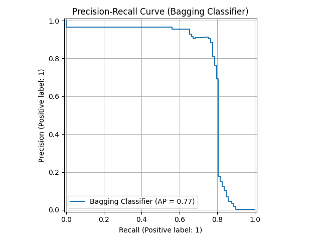
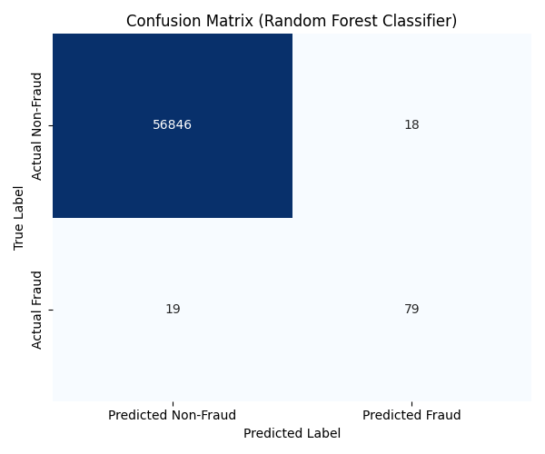
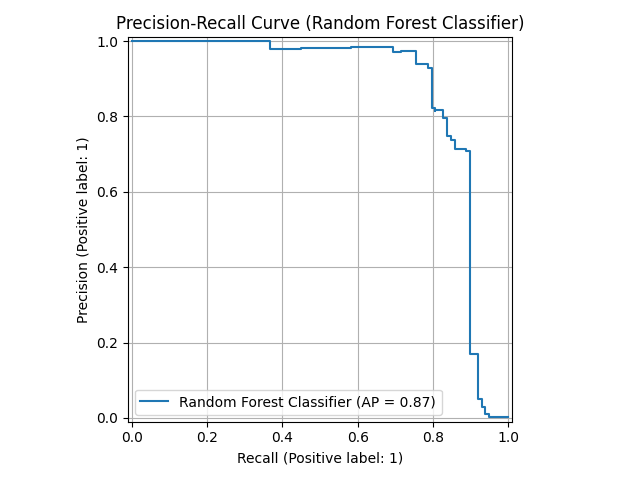
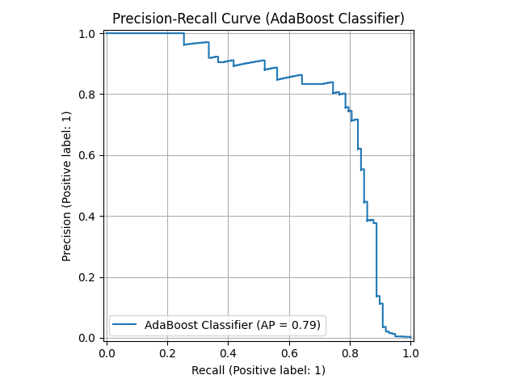
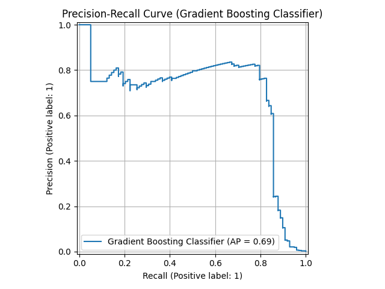
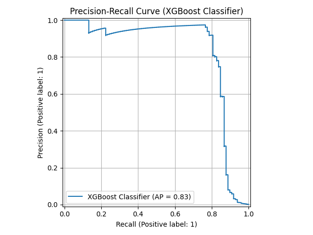
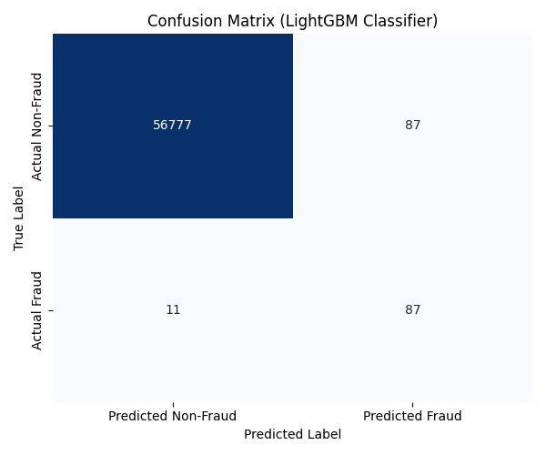
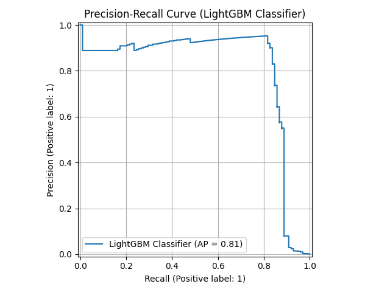

# **FraudGuard-EnsembleML: Credit Card Fraud Detection**

This repository contains Python scripts demonstrating various **Ensemble Machine Learning methods** for **Credit Card Fraud Detection** on an an **imbalanced dataset**. This project focuses on data preprocessing, handling class imbalance, training diverse ensemble models, and comprehensively evaluating their performance.

This project explores how different ensemble methods address the data imbalance challenge and compares their effectiveness.

## **Results**

### 1. **Bagging Models**

The bagging models are implemented in `random_forest_bagging_model.py`. These models train multiple base estimators independently on different subsets of the data and combine their predictions.

#### **Bagging Classifier**

Below are the plots for the Bagging Classifier.

* **Accuracy:** `0.998894`
* **Precision:** `0.642276`
* **Recall:** `0.806122`
* **F1-Score:** `0.714932`
* **ROC AUC:** `0.942855`

#### **Random Forest Classifier**

Below are the plots for the Random Forest Classifier.

* **Accuracy:** `0.999350`
* **Precision:** `0.814433`
* **Recall:** `0.806122`
* **F1-Score:** `0.810256`
* **ROC AUC:** `0.968820`

### 2. **Boosting Models**

The boosting models are implemented in `XGBoost_LightGBM_GB_AdaBoost_models.py`. These models build a sequence of weak learners, where each subsequent learner attempts to correct the errors of the previous ones.

#### **AdaBoost Classifier**

Below are the plots for the AdaBoost Classifier.

* **Accuracy:** `0.971788`
* **Precision:** `0.052756`
* **Recall:** `0.908163`
* **F1-Score:** `0.099720`
* **ROC AUC:** `0.974656`

#### **Gradient Boosting Classifier**

Below are the plots for the Gradient Boosting Classifier.

* **Accuracy:** `0.986728`
* **Precision:** `0.105516`
* **Recall:** `0.897959`
* **F1-Score:** `0.188841`
* **ROC AUC:** `0.980743`

#### **XGBoost Classifier**

Below are the plots for the XGBoost Classifier.

* **Accuracy:** `0.996945`
* **Precision:** `0.345528`
* **Recall:** `0.867347`
* **F1-Score:** `0.494186`
* **ROC AUC:** `0.975970`

#### **LightGBM Classifier**

Below are the plots for the LightGBM Classifier.

* **Accuracy:** `0.998280`
* **Precision:** `0.500000`
* **Recall:** `0.887755`
* **F1-Score:** `0.639706`
* **ROC AUC:** `0.969371`

## **Conclusion**

This project demonstrates the power of **Ensemble Methods** in tackling the challenging problem of **Credit Card Fraud Detection**. While all models achieved high overall accuracy, their performance on the minority (fraudulent) class, as reflected by **Precision**, **Recall**, and **F1-Score**, varied significantly.

**Random Forest** showed a strong balance of precision and recall among the bagging methods. Among boosting methods, **XGBoost** and **LightGBM** generally offered superior performance, particularly in balancing the detection of fraud (high recall) with minimizing false alarms (precision). The **Precision-Recall curves** provide crucial insights into each model's trade-off between these critical metrics for imbalanced datasets.